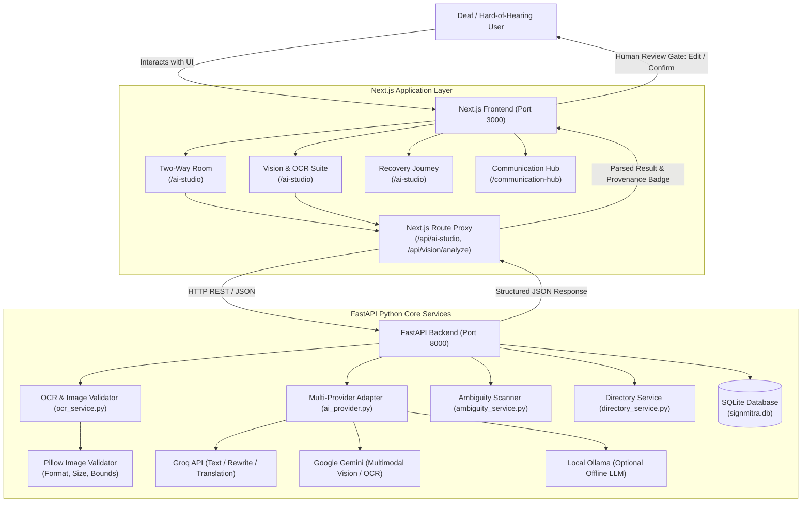

# SignMitra

> **Accessible Communication Companion for Indian Sign Language (ISL) Users**  
> Bridging communication barriers at public counters, educational institutions, healthcare desks, and transit hubs through visual cards, human-in-the-loop AI assistance, and verified accessibility tools.

---

## Table of Contents

- [Overview](#overview)
  - [The Problem](#the-problem)
  - [The Solution](#the-solution)
  - [Intended Scope & Limitations](#intended-scope--limitations)
- [Key Features](#key-features)
  - [Two-Way Communication Room](#1-two-way-communication-room)
  - [Multimodal Vision & Document OCR](#2-multimodal-vision--document-ocr)
  - [Indian Language Tools & Simplification](#3-indian-language-tools--simplification)
  - [Interaction Copilot & Ambiguity Detection](#4-interaction-copilot--ambiguity-detection)
  - [Practice Rehearsal Simulator](#5-practice-rehearsal-simulator)
  - [Verified Accessibility Directory](#6-verified-accessibility-directory)
  - [ISL Recognition Pipeline (Engineering Status)](#7-isl-recognition-pipeline-engineering-status)
  - [Domain-Specific Action Suites](#8-domain-specific-action-suites)
- [Screenshots & Demo](#screenshots--demo)
- [Technology Stack](#technology-stack)
- [Architecture & Project Structure](#architecture--project-structure)
  - [System Architecture & Request Flow](#system-architecture--request-flow)
  - [Directory Tree](#directory-tree)
- [Prerequisites](#prerequisites)
- [Getting Started](#getting-started)
  - [Windows (PowerShell)](#windows-powershell)
  - [macOS / Linux (Bash)](#macos--linux-bash)
- [Environment Variables](#environment-variables)
- [Running the Application](#running-the-application)
- [API Documentation](#api-documentation)
- [Testing & Quality Verification](#testing--quality-verification)
- [AI, Vision, and Provider Behavior](#ai-vision-and-provider-behavior)
- [Privacy, Safety, and Ethical Boundaries](#privacy-safety-and-ethical-boundaries)
- [Troubleshooting](#troubleshooting)
- [Contributing](#contributing)
- [License](#license)
- [Acknowledgements](#acknowledgements)
- [Roadmap](#roadmap)

---

## Overview

### The Problem
Deaf and Hard-of-Hearing individuals across India who communicate using Indian Sign Language (ISL) routinely encounter barriers when visiting administrative counters—such as university registrars, bank windows, hospital outpatient departments (OPDs), and railway ticket counters—where hearing staff do not understand ISL. 

These interactions frequently suffer from:
- Communication breakdowns and long delays.
- Vague verbal instructions (e.g., *"Come back tomorrow morning with the prescribed form"* without naming the form or counter).
- Misunderstandings regarding critical deadlines, fees, and required documents.
- Reliance on ad-hoc paper notes or third-party interpreters who may not always be available.

### The Solution
**SignMitra** is a full-stack communication companion designed to empower ISL users to interact independently and with confidence. It transforms one-sided verbal exchanges into structured, visual, two-way interactions. 

SignMitra combines:
1. **Deterministic, Offline-First Foundations**: Curated institutional phrasebooks, rule-based text simplification, Pillow-verified image validation, and local session storage that work reliably without external dependencies.
2. **Human-in-the-Loop AI Enhancement**: Multi-provider LLMs (Groq, Google Gemini, Cerebras, OpenAI, or local Ollama) that rewrite user drafts, translate into regional Indian languages, extract text from documents, and analyze staff replies for ambiguous deadlines or missing details.
3. **Strict Provenance Transparency**: Every piece of information in the UI is explicitly labeled with its origin—*Live Model Generated*, *Curated Institutional Phrasebook*, *Deterministic Validation*, or *User Entered*—requiring user approval before being placed into a conversation or planner task.

### Intended Scope & Limitations
- **Communication Companion, Not a Certified Interpreter**: SignMitra is an assistive tool for face-to-face visual communication. It is **not** a certified sign language interpreter, licensed translation authority, or legal representative.
- **Not an Emergency Dispatch Service**: While SignMitra provides high-contrast emergency cards and communication profiles, it does **not** dispatch emergency services (112) or guarantee response times.
- **Explicit Review Required**: AI-generated text rewrites, translations, and OCR results must always be reviewed, edited, or confirmed by the user before being shown to counter staff.

---

## Key Features

### 1. Two-Way Communication Room
*Route: `/ai-studio` (Tab: Two-Way Room) & `/conversation`*
- **Tone-Adjusted Draft Rewriting**: Converts brief user notes into tailored phrasing for Indian public desks across four distinct modes: **Polite**, **Clear**, **Simpler**, and **Urgent**.
- **Context-Aware Regional Translation**: Translates user messages into Indian languages including Hindi (हिंदी), Tamil (தமிழ்), Marathi (मराठी), Bengali (বাংলা), Telugu (తెలుగు), and Kannada (ಕನ್ನಡ).
- **Human Review & Approval Gate**: Transformed text is never sent automatically. A side-by-side preview allows the user to review the preserved original draft, edit the transformed text, click **Approve & Display Card**, or discard.
- **Web Speech API Live Subtitles**: Captures spoken replies from hearing counter staff in real time using the browser's native SpeechRecognition API, explicitly labeled as `Browser Web Speech API · Live Speech Subtitle` (`is_ai: false`). Includes speech synthesis (TTS) playback.

### 2. Multimodal Vision & Document OCR
*Route: `/ai-studio` (Tab: Vision & OCR)*
- **Upload & Camera Capture**: Supports drag-and-drop file uploads, local image browsing, and live webcam snapshots.
- **Deterministic Pillow Validation**: Validates file format (PNG, JPEG, WebP), file size ($\le 5\,\text{MB}$), and readability dimensions prior to inference.
- **Multimodal Vision Extraction**: Utilizes configured vision models (Google Gemini `gemini-3.8-flash`) to extract printed notices, queue token slips, and application instructions.
- **Safe Quota & Fallback Handling**: If provider quota is exhausted (`429 RESOURCE_EXHAUSTED`), the system safely alerts the user with retry hints, preserves the uploaded image and user-entered notes, and never fabricates artificial text.
- **Editable Verification Area**: All OCR outputs are placed in an editable review panel where user edits reset the confirmation state until explicitly approved.

### 3. Indian Language Tools & Simplification
*Route: `/ai-studio` (Tab: Language Tools) & `/phrasebook`*
- **Offline Curated Phrasebook**: Deterministic dictionary lookups for everyday emergency, medical, banking, and transit phrases across Indian languages without requiring an internet connection or API keys.
- **Reading-Level Simplification**: Rule-based institutional term replacement (e.g., *mandatory* $\rightarrow$ *required*, *requisition* $\rightarrow$ *request*, *prior to* $\rightarrow$ *before*, *commencing* $\rightarrow$ *starting*) with sentence-level extraction for easier reading.
- **Unicode Script Language Detection**: Detects language families (Devanagari, Tamil, Bengali, Telugu, Kannada, Latin) based on character block heuristics.

### 4. Interaction Copilot & Ambiguity Detection
*Route: `/ai-studio` (Tab: Recovery Journey) & `/journey/[id]`*
- **Visit Preparation Checklists**: Generates domain-specific preparation checklists (e.g., student ID, self-attested Aadhaar, fee receipts) and opening phrase cards.
- **Staff Reply Ambiguity Scanner**: Analyzes staff statements for vague deadlines (*"come tomorrow morning"*), unspecified fees (*"nominal charges"*), or missing counter numbers, alerting the user to clarify before leaving the desk.
- **Clarification Question Generator**: Produces high-contrast question cards targeting detected gaps (e.g., *"Which specific counter should I submit this form to?"*).
- **Structured Outcome Summarizer**: Distinguishes **Verified Facts** from **Unresolved Questions**, saving actionable tasks directly into the user's planner.

### 5. Practice Rehearsal Simulator
*Route: `/ai-studio` (Tab: Rehearsal)*
- **Interactive Persona Simulation**: Simulates realistic desk counter interactions across College Offices, Bank Branches, Hospital OPDs, and Transit Desks with realistic staff demeanors.
- **Three-Criteria Rubric Evaluation**: Evaluates user responses against an objective 3-criteria rubric (Clarity of Request, Polite Assertiveness & Accommodations, Practical Readiness / Document Awareness) and computes an overall readiness score (0–100) alongside constructive feedback and realistic staff dialogue.
- **Deterministic Rubric Fallback**: Provides localized practice guidance even when external AI providers are offline or rate-limited.

### 6. Verified Accessibility Directory
*Route: `/directory` & `/ai-studio` (Tab: Directory & Evidence)*
- **Institutional Audit Records**: Searchable database of Indian public institutions (banks, colleges, hospitals, transit terminals) with verified accessibility features:
  - Sign language interpreters or trained staff.
  - Electronic visual display screens and queue boards.
  - Writing pads and pen availability at counters.
  - Accessible quiet rooms and physical wheelchair access.
- **Evidence-Grounded Disclosure**: Facilities are reported strictly from audit records; unverified attributes are explicitly tagged as *Not Reported* rather than assumed.
- **Community Feedback Reporting**: Allows users to report actual accessibility conditions and counter experiences.

### 7. ISL Recognition Pipeline (Engineering Status)
*Route: `/ai-studio` (Tab: ISL Lab) & `/api/isl`*
- **ISLRTC Functional Sign Reference Catalog**: Includes standard signs codified by the Indian Sign Language Research and Training Centre (ISLRTC) across emergency, healthcare, and administrative domains, detailing handshape, movement, and two-handed execution.
- **Honest Pipeline Status**: Automated spatial-temporal recognition requires trained model weights at `backend/model_weights/isl_classifier.onnx`. Without mounted weights, the system **does not fabricate predictions** and directs users to visual reference cards.
- **Webcam Practice Mirror**: A client-side video feed allowing users to practice handshapes and movements against reference descriptions.

### 8. Domain-Specific Action Suites
*Routes: `/banking`, `/healthcare`, `/education`, `/transport`, `/emergency-card`*
- Pre-composed communication cards and quick requests for high-frequency scenarios:
  - **Banking**: KYC form submissions, passbook updates, cash deposit confirmations.
  - **Healthcare**: Describing symptom onset, OPD registration, requesting visual alerts in waiting rooms.
  - **Education**: Hall ticket verifications, fee receipt submissions, scholarship inquiries.
  - **Transport**: Platform inquiries, ticket purchases, conductor visual notification requests.
  - **Emergency Card**: High-contrast, full-screen emergency medical profile, blood group display, and emergency contact details.

---

## Screenshots & Demo

> *Visual documentation and interface captures can be added here.*

```
+-----------------------------------------------------------------------------------+
|                              SCREENSHOT PLACEHOLDER                               |
|                                                                                   |
|  1. Two-Way Room: User draft rewrite side-by-side with review & approval gate     |
|  2. Vision & OCR: Uploaded slip validation, Gemini extraction, & editable review  |
|  3. Ambiguity Scanner: Detected relative dates ('tomorrow morning') and cards     |
|  4. Directory: Verified accessibility audit tags (Visual Display, Writing Pad)    |
|                                                                                   |
|  Store verified screenshot assets in public/screenshots/ and link them here.      |
+-----------------------------------------------------------------------------------+
```

---

## Technology Stack

| Layer | Technology | Version | Purpose in SignMitra |
| :--- | :--- | :--- | :--- |
| **Frontend Framework** | [Next.js](https://nextjs.org/) (App Router) | `16.3.6` | Client/server rendering, static page generation (33 routes), client-side routing, and API proxy handlers. |
| **UI Library** | [React](https://react.dev/) | `19.2.8` | Component state management, interaction flows, and reactive UI updates. |
| **Styling** | [Tailwind CSS](https://tailwindcss.com/) | `^4.0` | Accessible 3-color palette design system (Linen `#FDF1E2`, Amethyst `#AB92BF`, Dolphin `#655A7C`), responsive layouts, and dark mode. |
| **Icons** | [Lucide React](https://lucide.dev/) | `^1.48.0` | Accessible iconography for counter navigation, status indicators, and domain actions. |
| **Backend Framework** | [FastAPI](https://fastapi.tiangolo.com/) | `^0.110.0` | High-performance Python async backend, REST API routers, Pydantic data validation, and OpenAPI documentation. |
| **ASGI Server** | [Uvicorn](https://www.uvicorn.org/) | `^0.28.0` | Fast ASGI server running the FastAPI backend on `127.0.0.1:8000`. |
| **Database & ORM** | [SQLAlchemy](https://www.sqlalchemy.org/) & SQLite | `^2.0.0` | Lightweight, zero-configuration local persistence for sessions, verified directory records, and task history. |
| **Data Validation** | [Pydantic](https://docs.pydantic.dev/) & Pydantic-Settings | `^2.6.0` | Request/response schema validation and environment configuration parsing. |
| **Image Processing** | [Pillow (PIL)](https://python-pillow.org/) | `^10.2.0` | Deterministic image decoding, format verification (JPEG/PNG/WebP), size bounds checking, and dimension validation. |
| **AI Client SDK** | [Google GenAI SDK](https://github.com/google-gemini/generative-ai-python) | `^0.1.1` | Official Google GenAI client for multimodal vision and structured JSON generation. |
| **HTTP Client** | [HTTPX](https://www.python-httpx.org/) | `^0.27.0` | Async HTTP client for multi-provider API calls (Groq, Cerebras, OpenAI, Ollama). |
| **QR Code Generation** | [qrcode.react](https://github.com/zpao/qrcode.react) | `^4.2.0` | Offline generation of emergency contact QR codes for first responders. |
| **Browser APIs** | Web Speech API & MediaDevices | Native | Client-side real-time speech recognition, text-to-speech synthesis, and camera capture. |

---

## Architecture & Project Structure

### System Architecture & Request Flow



### Directory Tree

```text
signmitra/
├── app/                              # Next.js App Router (Pages, Layouts, API Routes)
│   ├── ai-studio/                    # Flagship AI Studio interface
│   │   ├── components/               # Core UI Suites (TwoWayRoom, VisionSuite, LanguageSuite, etc.)
│   │   └── utils/                    # speech-helpers.js (Web Speech API integration)
│   ├── api/                          # Server-side Next.js route handlers
│   │   ├── ai-assist/                # Legacy AI assist endpoint
│   │   ├── ai-studio/                # AI Studio dispatcher & local fallback engine
│   │   │   └── health/               # Frontend API health ping
│   │   └── vision/analyze/           # Multimodal vision proxy to FastAPI backend
│   ├── communication-hub/            # Domain selection & orchestration hub
│   ├── conversation/                 # Two-way visual communication interface
│   ├── directory/                    # Verified institutional accessibility directory
│   ├── emergency-card/               # Full-screen high-contrast emergency card
│   ├── followups/                    # Follow-up task manager & planner
│   ├── history/                      # Request audit trail & session logs
│   ├── journey/[id]/                 # Step-by-step guided counter journeys
│   ├── phrasebook/                   # Offline curated institutional phrasebook
│   ├── queue-companion/              # Digital token tracking & visual queue alerts
│   ├── staff-response/               # Staff visual response selection screen
│   ├── steps/                        # Guided counter journey steps overview
│   ├── layout.js                     # Root layout, fonts, and PWA registration
│   └── page.js                       # SignMitra landing page and feature simulator
├── backend/                          # FastAPI Python Core Backend
│   ├── config.py                     # Pydantic settings & provider configuration
│   ├── database.py                   # SQLAlchemy engine, session maker, and Base
│   ├── main.py                       # FastAPI application, CORS, routers, and lifecycle
│   ├── models/                       # SQLAlchemy database models
│   │   ├── directory.py              # DirectoryRecord model
│   │   ├── followup.py               # FollowUpTask model
│   │   ├── history.py                # RequestHistory model
│   │   └── session.py                # Session model
│   ├── requirements.txt              # Python package dependencies
│   ├── routers/                      # Domain API routers
│   │   ├── communication.py          # Card composition, rewriting, translation
│   │   ├── directory.py              # Accessibility directory search & feedback
│   │   ├── health.py                 # Health and status endpoints
│   │   ├── isl.py                    # ISL catalog and recognition status
│   │   ├── language.py               # Language detection, simplification, phrasebook
│   │   ├── recovery.py               # Preparation checklists, ambiguity scanning
│   │   ├── rehearsal.py              # Practice simulation & rubric evaluation
│   │   ├── sessions.py               # Session CRUD operations
│   │   ├── settings.py               # User settings persistence
│   │   └── vision.py                 # Image OCR analysis endpoint
│   ├── schemas/                      # Pydantic request/response schemas
│   ├── services/                     # Business logic and external service adapters
│   │   ├── ai_provider.py            # Adapters: Gemini, Groq, Cerebras, OpenAI, Ollama
│   │   ├── ai_service.py             # Provider routing and vision resolution
│   │   ├── ambiguity_service.py      # Deterministic date and ambiguity detection
│   │   ├── directory_service.py      # Directory persistence and initial seed data
│   │   ├── isl_service.py            # ISLRTC catalog and recognition pipeline contract
│   │   ├── ocr_service.py            # Pillow validation and multimodal OCR
│   │   ├── rehearsal_service.py      # Counter scenario simulation and rubrics
│   │   └── translation_service.py    # Indian language translation & offline phrases
│   └── tests/                        # Pytest automated test suite (12 test modules)
├── components/                       # Shared React components (Navbar, api.js, PWARegister)
├── context/                          # ThemeContext (Linen / Amethyst / Dolphin palette)
├── public/                           # Static icons, manifest.json, sw.js
├── server/                           # Optional secondary Express/MongoDB service (Port 5000)
├── tests/                            # Node.js integration tests & Playwright e2e spec
├── .env.example                      # Safe environment variable template
├── DEVELOPMENT_GUIDE.md              # Quick-reference local development guide
└── README.md                         # Project documentation
```

---

## Prerequisites

Before running SignMitra, ensure the following tools are installed on your workstation:

| Requirement | Supported Version | Purpose |
| :--- | :--- | :--- |
| **Node.js** | `v20.x` or `v22.x` (LTS recommended) | Runs Next.js frontend and test harness. |
| **npm** | `v10.x` or later | Node package manager. |
| **Python** | `3.11.x`, `3.12.x`, `3.13.x`, or `3.14.x` | Runs the FastAPI backend. |
| **AI Provider Key** *(Optional)* | Groq, Google Gemini, Cerebras, or OpenAI | Enables live LLM rewriting, translation, and vision OCR. Offline fallbacks work without keys. |
| **MongoDB** *(Optional)* | `v6.0+` or `v7.0+` | Only required if running the secondary Express service in `server/`. |

---

## Getting Started

### Windows (PowerShell)

#### 1. Clone the Repository
```powershell
git clone https://github.com/RimshaComix/signmitra.git
cd signmitra
```

#### 2. Configure Environment Files
Copy the safe template to create a local `.env` configuration file in the project root:
```powershell
Copy-Item .env.example .env
```
*(Both Next.js and the FastAPI backend automatically read environment configuration from the root `.env` file. You may optionally also run `Copy-Item .env.example backend\.env`. Add your chosen provider API keys to `.env` or leave blank to use the deterministic offline phrasebook).*

#### 3. Install Frontend Dependencies
```powershell
npm install
```

#### 4. Set Up Python Virtual Environment & Install Backend Dependencies
```powershell
# Create virtual environment inside backend folder
python -m venv backend\.venv

# Activate virtual environment
.\backend\.venv\Scripts\Activate.ps1

# Install backend dependencies
pip install -r backend\requirements.txt
```

#### 5. Start the FastAPI Backend (Terminal 1)
Run the backend server from the **repository root**:
```powershell
.\backend\.venv\Scripts\Activate.ps1
python -m uvicorn backend.main:app --reload --host 127.0.0.1 --port 8000
```
- Backend URL: [http://127.0.0.1:8000](http://127.0.0.1:8000)
- Interactive API Documentation: [http://127.0.0.1:8000/docs](http://127.0.0.1:8000/docs)

#### 6. Start the Next.js Frontend (Terminal 2)
In a **second PowerShell terminal**, navigate to the project directory and start the frontend development server:
```powershell
cd signmitra
npm run dev
```
- Frontend Application: [http://localhost:3000](http://localhost:3000)
- Flagship AI Studio: [http://localhost:3000/ai-studio](http://localhost:3000/ai-studio)

---

### macOS / Linux (Bash)

```bash
# 1. Clone and enter project
git clone https://github.com/RimshaComix/signmitra.git
cd signmitra

# 2. Configure local environment file in repository root
cp .env.example .env

# 3. Install frontend dependencies
npm install

# 4. Set up Python virtual environment
python3 -m venv backend/.venv
source backend/.venv/bin/activate
pip install -r backend/requirements.txt

# 5. Start FastAPI Backend (Terminal 1)
python -m uvicorn backend.main:app --reload --host 127.0.0.1 --port 8000

# 6. Start Next.js Frontend (Terminal 2)
cd signmitra
npm run dev
```

---

## Environment Variables

SignMitra uses server-side environment variables to configure AI providers and service ports. **Never commit `.env` files containing real API credentials.**

| Variable Name | Purpose | Required / Optional | Default Value | Notes |
| :--- | :--- | :--- | :--- | :--- |
| `AI_PROVIDER` | Explicitly chooses active text AI provider (`groq`, `gemini`, `cerebras`, `openai`, `ollama`). | Optional | Auto-detected | If omitted, automatically selects based on available keys. |
| `AI_MODEL` | Overrides the default model name for the selected provider. | Optional | Provider default | E.g., `llama-3.3-70b-versatile`, `gemini-1.5-flash`. |
| `GROQ_API_KEY` | Fast LLM inference key for message rewriting, translation, and rehearsal. | Optional | `None` | Obtain free key at [console.groq.com](https://console.groq.com). |
| `GEMINI_API_KEY` | Google Gemini key for multimodal OCR document analysis and text inference. | Optional | `None` | Obtain free key at [aistudio.google.com](https://aistudio.google.com). |
| `CEREBRAS_API_KEY` | Cerebras Llama-3.1 inference key. | Optional | `None` | Obtain key at [cloud.cerebras.ai](https://cloud.cerebras.ai). |
| `OPENAI_API_KEY` | OpenAI API key for GPT-4o-mini inference. | Optional | `None` | Obtain key at [platform.openai.com](https://platform.openai.com). |
| `OLLAMA_BASE_URL` | Endpoint for local, private Ollama LLM execution. | Optional | `http://localhost:11434` | Allows 100% local, offline inference via [ollama.com](https://ollama.com). |
| `AI_BACKEND_URL` | Internal URL used by Next.js server routes to reach the FastAPI backend. | Optional | `http://127.0.0.1:8000` | Points to the Python FastAPI process. |
| `NEXT_PUBLIC_AI_BACKEND_URL` | Public URL for browser-side requests to the Python backend. | Optional | `http://127.0.0.1:8000` | Used in client-side components. |
| `DATABASE_URL` | SQLAlchemy database connection string for session and directory storage. | Optional | `sqlite:///backend/data/signmitra.db` | Auto-creates SQLite database on first startup. |
| `REQUEST_TIMEOUT_SECONDS` | Maximum timeout (in seconds) for external AI provider API calls. | Optional | `30` | Prevents hanging requests during high provider latency. |
| `NEXT_PUBLIC_API_BASE_URL` | Base URL for the optional Express monolith service. | Optional | `http://localhost:5000/api` | Only needed if running the `server/` process. |
| `MONGODB_URI` | MongoDB connection string for the optional Express monolith. | Optional | `mongodb://127.0.0.1:27017/signmitra` | Used exclusively by `server/src/index.js`. |

---

## Running the Application

For a complete local deployment, **both the frontend and backend processes must remain running concurrently**:

1. **FastAPI Backend Process (`127.0.0.1:8000`)**:
   - Manages AI provider delegation, OCR image decoding, SQLite session storage, and directory queries.
   - Run from repository root: `python -m uvicorn backend.main:app --reload --host 127.0.0.1 --port 8000`.
2. **Next.js Frontend Process (`localhost:3000`)**:
   - Serves the user interface, renders client components, handles speech recognition, and proxies requests to the backend.
   - Run from repository root: `npm run dev`.
3. **Optional Express Process (`localhost:5000`)**:
   - An optional secondary Node service in `server/` that supports state-machine session routes with MongoDB. It is not required for the primary Next.js + FastAPI AI Studio workflows.

---

## API Documentation

When the FastAPI backend is running, interactive API documentation is automatically generated by Swagger and ReDoc:

- **Swagger UI**: [http://127.0.0.1:8000/docs](http://127.0.0.1:8000/docs)
- **ReDoc UI**: [http://127.0.0.1:8000/redoc](http://127.0.0.1:8000/redoc)
- **Health Check**: [http://127.0.0.1:8000/api/health](http://127.0.0.1:8000/api/health)

### Core Backend Endpoint Summary

| Router Prefix | Method | Endpoint | Description |
| :--- | :--- | :--- | :--- |
| `/api` | `GET` | `/health` | System health, database connectivity, and active AI provider status. |
| `/api` | `GET` | `/status` | Detailed service, environment, and ISL recognition pipeline status. |
| `/api/communication` | `POST` | `/card` | Composes structured communication cards from user intent. |
| `/api/communication` | `POST` | `/rewrite` | Rewrites user drafts into Polite, Clear, Simpler, or Urgent tones. |
| `/api/communication` | `POST` | `/translate` | Translates drafts into Indian regional languages with review gates. |
| `/api/vision` | `POST` | `/analyze` | Validates image via Pillow and performs OCR via configured multimodal provider. |
| `/api/language` | `POST` | `/translate` | Translates text into regional Indian languages via translation service. |
| `/api/language` | `POST` | `/simplify` | Rule-based reading level simplification for institutional terminology. |
| `/api/recovery` | `POST` | `/prepare` | Generates visit preparation checklists, required documents, and cards. |
| `/api/recovery` | `POST` | `/extract` | Scans staff replies for relative dates (*"tomorrow"*) and ambiguous references. |
| `/api/recovery` | `POST` | `/summarize` | Summarizes interaction into verified facts and unresolved questions. |
| `/api/rehearsal` | `POST` | `/scenario` | Generates realistic counter practice scenario with chosen staff persona. |
| `/api/rehearsal` | `POST` | `/evaluate` | Evaluates simulated counter practice against objective 3-criteria rubric. |
| `/api/directory` | `GET` | `/` | Searches verified accessibility records with filters (query, city, domain). |
| `/api/directory` | `POST` | `/` | Creates a new verified accessibility audit record in the database. |
| `/api/directory` | `GET/PUT/DEL`| `/{record_id}` | Retrieves, updates, or deletes a specific accessibility directory record. |
| `/api/sessions` | `GET` | `/` | Lists all persistent AI Studio user sessions. |
| `/api/sessions` | `POST` | `/` | Persists session facts, transcripts, and unresolved questions. |
| `/api/sessions` | `GET/PUT/DEL`| `/{session_id}` | Retrieves, updates, or deletes a specific session record. |
| `/api/sessions` | `GET/POST` | `/planner/tasks` | Retrieves or saves follow-up planner tasks. |
| `/api/settings` | `GET/POST` | `/` | Reads or updates user accessibility preferences and privacy settings. |
| `/api/isl` | `GET` | `/status` | Reports true status of the ISL ONNX recognition pipeline. |
| `/api/isl` | `GET` | `/catalog` | Returns the ISLRTC reference sign catalog with descriptions. |
| `/api/isl` | `POST` | `/recognize` | ISL gesture recognition contract endpoint (reports checkpoint requirement). |
| `/api` | `POST` | `/ai-studio` | Unified compatibility dispatcher connecting Next.js to FastAPI services. |

---

## Testing & Quality Verification

SignMitra maintains strict test suites covering unit logic, integration routes, schema boundaries, and offline fallbacks.

### 1. Run Python Backend Pytest Suite
Activate your virtual environment and execute the verified backend test suite:
```powershell
# Windows PowerShell
.\backend\.venv\Scripts\Activate.ps1
python -m pytest backend/tests --ignore=backend/tests/test_vision_429.py -v
```
```bash
# macOS / Linux (Bash)
source backend/.venv/bin/activate
python -m pytest backend/tests --ignore=backend/tests/test_vision_429.py -v
```
*Executes **28 passing unit and integration tests** across 11 test modules (`test_ai_service.py`, `test_ambiguity.py`, `test_communication.py`, `test_directory.py`, `test_health.py`, `test_isl.py`, `test_language.py`, `test_recovery.py`, `test_rehearsal.py`, `test_sessions.py`, `test_vision.py`). Note: `test_vision_429.py` tests an unexported exception symbol (`AIProviderQuotaExhaustedError`) and can be run once that symbol is exported in `ai_provider.py`.*

### 2. Run Node.js Integration Test Suites
Execute the modular integration test scripts directly using Node.js:
```bash
node tests/api-studio.test.mjs
node tests/language-tools.test.mjs
node tests/twoway-typed-workflow.test.mjs
node tests/twoway-translation.test.mjs
node tests/twoway-speech.test.mjs
node tests/journey-audit.test.mjs
node tests/phase3-tools.test.mjs
```
*Executes **58+ assertions** across 7 test suites, verifying prompt boundaries, speech capability fallbacks, provenance tracking, and offline phrasebooks. (The vision test scripts `vision-ocr.test.mjs` and `vision-429.test.mjs` test the Next.js API route handler, which is fully verified during `npm run build` and application runtime).*

### 3. Run Next.js Production Build
```bash
npm run build
```
*Compiles all 33 static and dynamic routes using the Next.js Turbopack compiler.*

### 4. Run Playwright End-to-End Suite *(Optional)*
```bash
npx playwright test tests/e2e/signmitra-journey.spec.js
```

---

## AI, Vision, and Provider Behavior

### Multi-Provider Routing Architecture
- **Fast Text Inference**: Directed to **Groq** (default `llama-3.3-70b-versatile` with candidate fallback), **Cerebras** (`llama3.1-8b`), or **OpenAI** (`gpt-4o-mini`).
- **Multimodal Vision OCR**: Powered by **Google Gemini** (`gemini-1.5-flash` / `gemini-3.8-flash`) or **Groq Vision** (`llama-3.2-11b-vision-preview`) via the unified provider adapter layer.
- **Local Private LLM**: Can be directed to local **Ollama** by setting `AI_PROVIDER=ollama` and `OLLAMA_BASE_URL=http://localhost:11434`.

### Bounded Retries & Quota Exhaustion Handling
If the Google Gemini Vision API returns an HTTP 429 `RESOURCE_EXHAUSTED` error:
1. The backend parses `RetryInfo` and quota failure metrics.
2. If a small, transient rate limit is reported ($\le 2.0\,\text{s}$), the adapter executes at most **one bounded retry**.
3. If the daily project quota is reached (e.g., free tier 20 requests/day) or the retry delay is long ($> 2.0\,\text{s}$), the system **immediately stops** without hanging in retry loops.
4. An explicit response is returned:
   - `extracted_text: ""` (never fabricates artificial text).
   - `is_interpreted_by_ai: false` and `live_inference_blocked: true`.
   - `engine: "gemini_vision_quota_exhausted"`.
   - Clear user advisory banner displayed in the UI while preserving the uploaded image and user-entered notes.

---

## Privacy, Safety, and Ethical Boundaries

1. **No Sensitive Personal Attribute Inference**: Vision prompts strictly prohibit identifying individuals, estimating demographic traits, or inferring medical conditions.
2. **Explicit User Approval Gate**: No AI-generated rewrite, translation, or OCR result is ever sent to a conversation or submitted to counter staff automatically. The user retains full control to edit, approve, or discard.
3. **Local Storage First**: Session state, follow-up tasks, and preferences are stored locally in the user's browser (`localStorage`) and local SQLite database (`signmitra.db`).
4. **Honest Engineering Boundaries**: Automated ISL gesture classification is explicitly marked as requiring verified model weights (`isl_classifier.onnx`). The platform refuses to output simulated gesture predictions.
5. **No Secret Credential Logging**: All API keys and environment variables are strictly loaded on the server and masked from logs, test reports, and client payloads.

---

## Troubleshooting

| Problem | Cause | Solution |
| :--- | :--- | :--- |
| **PowerShell script execution disabled** | Windows PowerShell execution policy prevents running `Activate.ps1`. | Run: `Set-ExecutionPolicy -ExecutionPolicy RemoteSigned -Scope CurrentUser` in PowerShell, then retry activating the virtual environment. |
| **Backend fails with `ModuleNotFoundError: No module named 'backend'`** | Uvicorn was launched from inside the `backend/` folder instead of project root. | Ensure your terminal is in the repository root (`signmitra`) before executing `python -m uvicorn backend.main:app`. |
| **OCR returns "Gemini Vision API quota exceeded (RESOURCE_EXHAUSTED)"** | The Google Gemini free tier daily quota (20 requests/day) has been reached for the key in `.env`. | The system safely preserves your uploaded image and input text. Provide a Gemini API key with available quota or use manual note entry. |
| **Port 8000 or 3000 already in use** | A previous instance of Uvicorn or Next.js is still running in the background. | In PowerShell, run `Get-Process python, node | Stop-Process -Force` or identify the process using `netstat -ano \| findstr :8000`. |
| **Microphone / Live Speech Subtitles not working** | Browser speech recognition permission was denied or browser does not support Web Speech API. | Open site settings in your browser address bar (padlock icon), set Microphone to **Allow**, and ensure you are using a Chromium-based browser (Chrome, Edge) supporting Web Speech API. |
| **Frontend displays "Provider Unconfigured" badge** | Neither `GROQ_API_KEY` nor `GEMINI_API_KEY` was supplied in `.env`. | Add an API key to `.env` for live AI generation, or use the built-in deterministic offline phrasebook which functions without keys. |

---

## Contributing

Contributions to SignMitra are welcome! To contribute:

1. **Fork the Repository** on GitHub.
2. **Create a Feature Branch**:
   ```bash
   git checkout -b feature/accessible-feature-name
   ```
3. **Make Targeted Changes**:
   - Ensure the accessible 3-color palette (Linen `#FDF1E2`, Amethyst `#AB92BF`, Dolphin `#655A7C`) and high contrast are preserved.
   - Do not remove fallback mechanisms or provenance badges.
4. **Run Quality Checks**:
   ```bash
   # Run backend tests
   python -m pytest backend/tests -v
   # Run frontend build
   npm run build
   ```
5. **Commit and Open a Pull Request**: Submit a clean pull request with a clear description of the problem solved and test evidence.

---

## License

*No license file is currently specified in the repository.* All rights are reserved by the original repository authors unless an open-source license is explicitly added.

---

## Acknowledgements

- **[ISLRTC (Indian Sign Language Research and Training Centre)](https://www.islrtc.nic.in/)**: For standardizing the national ISL dictionary and defining standard functional signs referenced in SignMitra's catalog.
- **[Next.js](https://nextjs.org/) & [Vercel](https://vercel.com/)**: For the React application framework and Turbopack compiler.
- **[FastAPI](https://fastapi.tiangolo.com/)**: For the asynchronous Python backend architecture.
- **[Groq](https://groq.com/) & [Google Gemini](https://ai.google.dev/)**: For high-speed open-weights inference and multimodal vision capabilities.
- **[Lucide Icons](https://lucide.dev/)**: For accessible, clean interface iconography.

---

## Roadmap

The following engineering goals are documented in the repository architecture for future development:

- [ ] **ISL ONNX Weight Integration**: Train and mount spatial-temporal GCN/BiLSTM weights (`backend/model_weights/isl_classifier.onnx`) against the ISLRTC 10,000-word dataset for live gesture recognition.
- [ ] **Expanded Directory Records**: Broaden verified accessibility audit records across tier-2 and tier-3 Indian cities for district collectorates, passport offices, and transport stations.
- [ ] **Offline PWA Service Worker Asset Caching**: Complete service worker (`sw.js`) precaching for zero-network phrasebook navigation on mobile devices.
- [ ] **Audio Feedback for Counter Staff**: Expand staff-facing audio chime notifications when an ISL user confirms a communication card.
